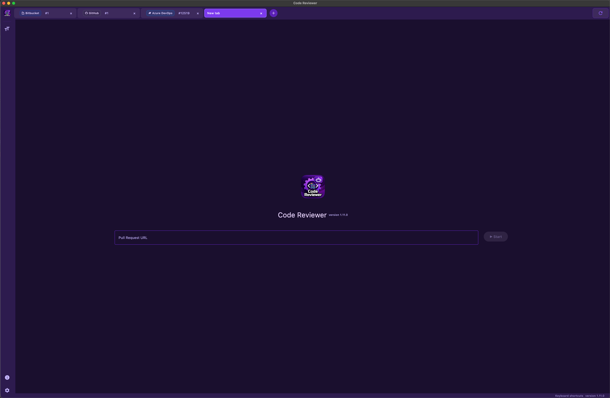
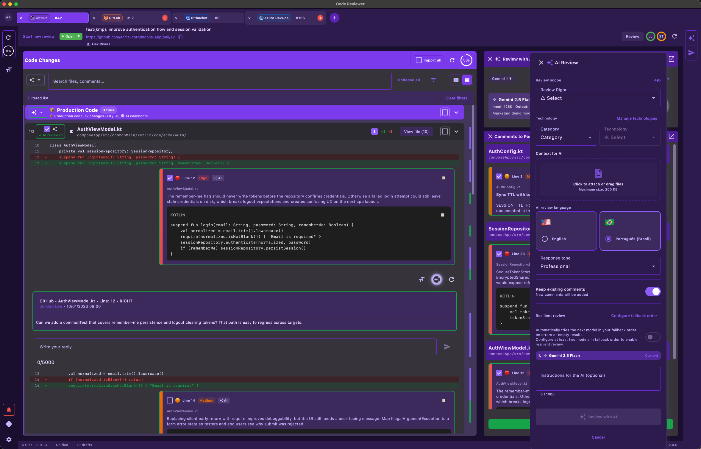
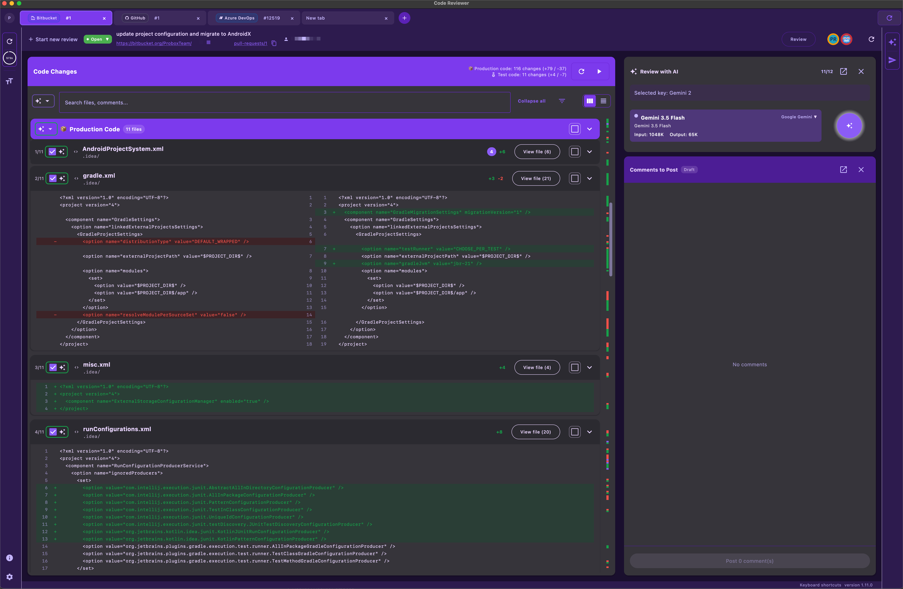
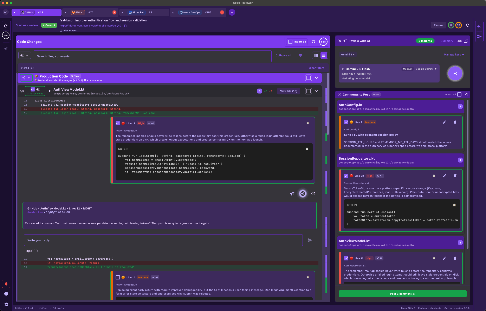
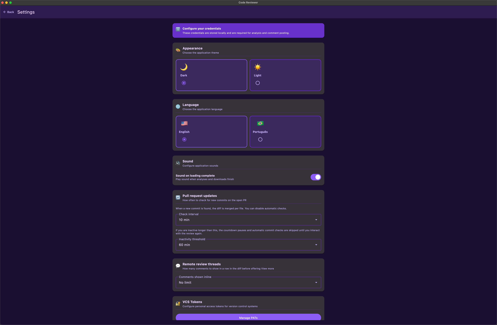

# Code Reviewer

> **Say goodbye to costly Code Review**

**Code Reviewer** is an AI-powered code review assistant for **macOS**, **Windows**, and **Linux**. Automate analyses, publish comments directly on Pull Requests, and reduce review time by up to 80%.

---

## Download

**Latest version: [1.14.1](https://github.com/studiopaulomoraes/Probox-CodeReviewer-releases/releases/tag/1.14.1)** · [All releases](https://github.com/studiopaulomoraes/Probox-CodeReviewer-releases/releases)

| Platform | Architecture | Format | Download |
|----------|--------------|--------|----------|
| **Windows** | x64 | ZIP | [**Download**](https://github.com/studiopaulomoraes/Probox-CodeReviewer-releases/releases/download/1.14.1/CodeReviewer-1.14.1-win.zip) |
| **macOS** | Apple Silicon (M1/M2/M3/M4) | ZIP | [**Download**](https://github.com/studiopaulomoraes/Probox-CodeReviewer-releases/releases/download/1.14.1/CodeReviewer-1.14.1-mac.zip) |
| **macOS** | Intel (x64) | ZIP | [**Download**](https://github.com/studiopaulomoraes/Probox-CodeReviewer-releases/releases/download/1.14.1/CodeReviewer-1.14.1-mac.zip) |
| **Linux** | amd64 | DEB | [**Download**](https://github.com/studiopaulomoraes/Probox-CodeReviewer-releases/releases/download/1.14.1/code-reviewer_1.14.1_amd64.deb) |

<strong>First launch notes</strong>

- **macOS:** On first launch, right-click the app and choose **Open**.
- **Windows:** SmartScreen may warn on first run — choose **More info**, then **Run anyway**.
- **Linux:** Installing the package may prompt for your password in the package manager.

---

## Screenshots

### PR input

Paste a Pull Request URL and start the review. Multiple tabs let you work on Bitbucket, GitHub, Azure DevOps, and GitLab PRs in parallel.

### AI review

Configure rigor, technology stack, attached context, review language, and optional instructions before running the analysis.

### Review workspace

Loaded PR with file list, side-by-side diff, and the AI review panel. Tabs show simultaneous reviews across different VCS providers.

### Comments & collaboration

AI findings appear inline in the diff and as draft comments. Review, edit, and post them directly to the remote PR.

### Settings

Theme, language, sounds, PR update polling, inline comment limits, and VCS token management.

---

## Features

### 🤖 Intelligent AI Analysis

- **Multiple AI providers**: Google Gemini and OpenAI (ChatGPT)
- **Dynamic models**: choose from various models (e.g., `gemini-1.5-flash`, `gpt-4o-mini`, `gpt-4o`) based on your needs
- **Adjustable criticality levels**:
    - **HIGH** — strict (ideal for junior teams)
    - **MEDIUM** — moderate (mid-level)
    - **LOW** — basic (senior)
    - **NONE** — default
- **Automatic detection** of bugs, vulnerabilities, and improvement suggestions
- **AI-generated diff summary** for a quick overview
- **Enriched context**: attach files (drag & drop or file picker) to enrich the analysis prompt
- **Conversation history** (ChatSession) maintained for continuous context across analyses

### 🔗 VCS Integration

| Provider | Support | Supported URLs |
|----------|---------|----------------|
| **Azure DevOps** | ✅ | `dev.azure.com/{org}/{proj}/_git/{repo}/pullrequest/{id}` |
| **GitHub** | ✅ | `github.com/{owner}/{repo}/pull/{id}` |
| **GitLab** | ✅ | `gitlab.*/.../merge_requests/{id}` |
| **Bitbucket** | ✅ | `bitbucket.org/{workspace}/{repo}/pull-requests/{id}` |

- **Paste the PR URL** and the app automatically loads the diff and metadata
- **Multiple PATs** per provider — choose which account to use in each tab
- **Permission checks** (GitHub repo, GitLab role) before posting
- **Authenticated images** on Azure DevOps via dedicated interceptor

### 💬 Comments and Collaboration

- **Direct publishing** of comments on Pull Requests (Azure DevOps, GitHub, GitLab, Bitbucket)
- **Severities**: CRITICAL, HIGH, MEDIUM, LOW, UNKNOWN
- **Draft comments**: create and edit comments locally before publishing
- **Remote threads** with provider-specific cards
- **Discussion resolution** on GitLab (resolve/reopen)
- **Thread status** on Azure DevOps
- **Review vote** on Azure DevOps: Approve, Reject, Wait

### 📂 Diff Viewer

- **Side-by-side diff** for clear comparison
- **File list** with quick navigation
- **Diff search** (Cmd/Ctrl + F)
- **Production filter**: ignore test files in the analysis
- **Markdown rendering** in comments and code blocks
- **Configurable typography** for diff, comments, and UI

### 🛠️ Customizable Technology Stack

- **TechStack**: Android, iOS, Flutter, KMP, React Native, Other
- **TechCategory**: Mobile, Web, Backend, Desktop, DevOps/Cloud, Other
- **Custom technologies**: add technologies by category for more accurate analyses
- **Built-in technologies** for common scenarios

### 📑 Productivity

- **Up to 5 simultaneous tabs** — review multiple PRs at the same time
- **Keyboard shortcuts** throughout the application:
    - `Cmd/Ctrl + ,` — Settings
    - `Cmd/Ctrl + T` — New tab
    - `Cmd/Ctrl + W` — Close tab
    - `Ctrl + Tab` / `Ctrl + Shift + Tab` — Navigate between tabs
    - `Cmd/Ctrl + =` / `Cmd/Ctrl + -` / `Cmd/Ctrl + 0` — Adjust font size
    - `Cmd/Ctrl + S` — Save changes
    - `Cmd/Ctrl + F` — Search
    - `Cmd/Ctrl + Shift + /` — Shortcuts dialog
- **Optional sound** when analysis completes
- **Automatic updates** via manifest or GitHub Releases

### 🎨 Interface and Accessibility

- **Light and dark theme** (Light/Dark)
- **Configurable font sizes** for diff, comments, and UI
- **Material Design 3** — modern and consistent interface
- **Contextual tooltips**
- **Drag & drop** files for additional context
- **Responsive layout** with adaptable typography scale

### ⚙️ Settings

- **API keys**: Gemini and OpenAI (multiple keys supported)
- **PATs**: Azure DevOps, GitHub, GitLab, Bitbucket
- **Technologies**: custom list by category
- **Theme**: Light / Dark
- **Fonts**: Diff, Comments, UI
- **Completion sound**: enable/disable

---

## Platforms

| Platform | Format | Architectures |
|----------|--------|---------------|
| **macOS** | ZIP | Apple Silicon (arm64), Intel (x64) |
| **Windows** | ZIP | x64 |
| **Linux** | DEB | amd64 |

- **Built-in automatic updates** (macOS, Windows, Linux)
- **Error monitoring** with Sentry

---

## Why Code Reviewer?

1. **Save time** — reduce review time by up to 80%
2. **Multi-VCS** — one app for Azure DevOps, GitHub, GitLab, and Bitbucket
3. **Multi-AI** — choose between Gemini and OpenAI as you prefer
4. **Custom context** — attach files and define technologies for more accurate analyses
5. **Direct publishing** — publish comments on the PR without leaving the app
6. **Cross-platform** — macOS, Windows, and Linux with the same experience
7. **Automatic updates** — always stay on the latest version

---

*Developed by [Probox Studio](https://proboxstudio.com.br)*
